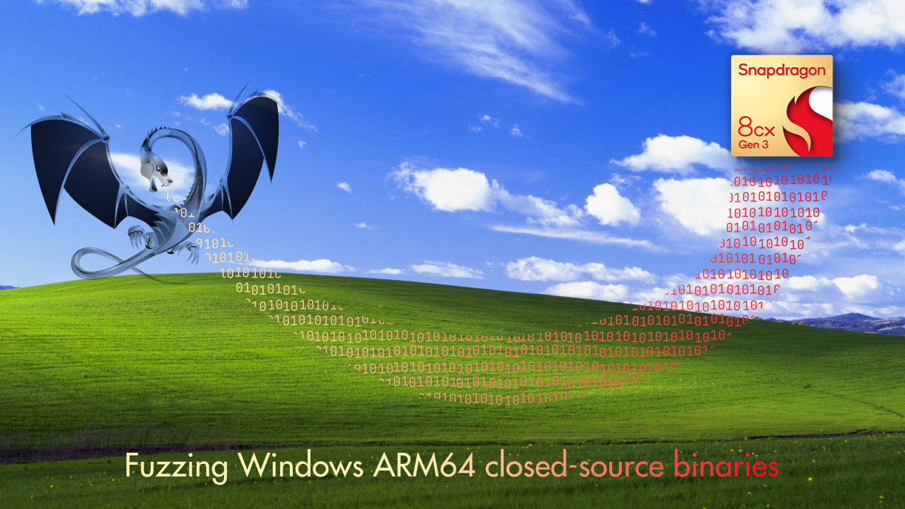

   
   
  

<h3 align="center">Fuzzing Windows ARM64 closed-source binaries</h4>

This repository contains the material associated with the blog post
[Fuzzing Windows ARM64 closed-source binaries](https://www.romainthomas.fr/post/25-04-windows-arm64-qbdi-fuzzing)

| Executable                                           | PDB                                                  | Description
| :------                                              | :-----------                                         | :-----------
| [fuzzme-nofeedback.exe](./bin/fuzzme-nofeedback.exe) | [fuzzme-nofeedback.pdb](./bin/fuzzme-nofeedback.pdb) | Blind fuzzing (no feedback)
| [fuzzme-cov.exe](./bin/fuzzme-cov.exe)               | [fuzzme-cov.pdb](./bin/fuzzme-cov.pdb)               | Feedback with source/compile instrumentation
| [fuzzme-qbdi.exe](./bin/fuzzme-qbdi.exe)             | [fuzzme-qbdi.pdb](./bin/fuzzme-qbdi.pdb)             | Runtime feedback with a DBI (QBDI)
